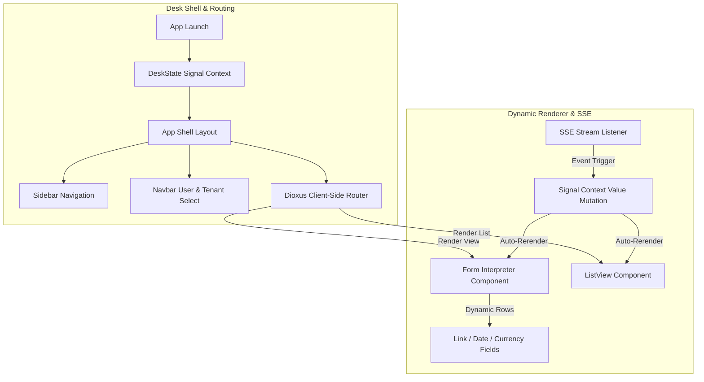

# Diagrams: frappe-desk-ui

The diagram below shows the reactivity loop of the Dioxus client-side application, displaying how layout, router, user events, and real-time SSE stream events mutate global signal state:

