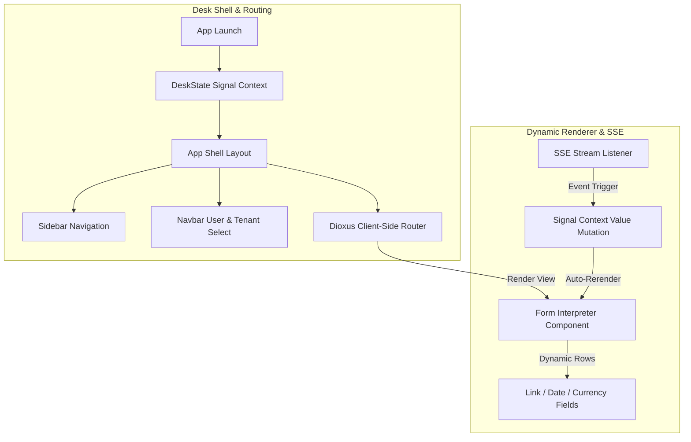

# Frappe Desk UI Client (WASM Edition)

This workspace contains the frontend Single-Page Application (SPA) compiled to `wasm32-unknown-unknown` using the modern Dioxus web toolkit. It powers the workspace Desk interface, rendering metadata-driven forms, sidebar layout systems, and real-time updates.

## Reactivity & Layout

---

## Workspace Layout

### 1. `desk-app`
Main SPA shell initialization:
- **`main.rs`**: Configures the root component, initializes the global `DeskState` signal tracking wrapper, and binds layout rendering.
- **`state.rs`**: Houses fields for `active_site`, `current_user`, and `open_tabs` tracked using Dioxus signal primitives.
- **`router.rs`**: Configures page layout transitions and view templates for navigation paths.

### 2. `desk-components`
Reusable interactive widget layers:
- **`layout/`**: Contains the main navigation components:
  - **`sidebar.rs`**: Sidebar workspace selection options mapping to state signals.
  - **`navbar.rs`**: Top bar branding banner, user status profiles, and tenant database switches.
- **`form_engine/`**: Handles dynamic UI views:
  - **`interpreter.rs`**: Walks through metadata DocType field schemas to compile input grids.
  - **`fields.rs`**: Hosts input controls including autocomplete `LinkField` search requests and formatted `CurrencyField` inputs.
- **`sse.rs`**: Mounts a persistent Server-Sent Events (SSE) listener mapping `/api/v2/stream` data frames back to Dioxus signal mutations.

---

## Technical Architecture

- **Dioxus 0.7.9**: A modern, signal-based reactive web framework compiling directly to WebAssembly. Uses `use_signal()` tracking contexts.
- **Web-Sys & Wasm-Bindgen**: Accesses native browser event listeners, DOM input properties, and WebAssembly worker modules.
- **Gloo-Timers**: Provides asynchronous futures timeout handles inside inputs and search queries.
